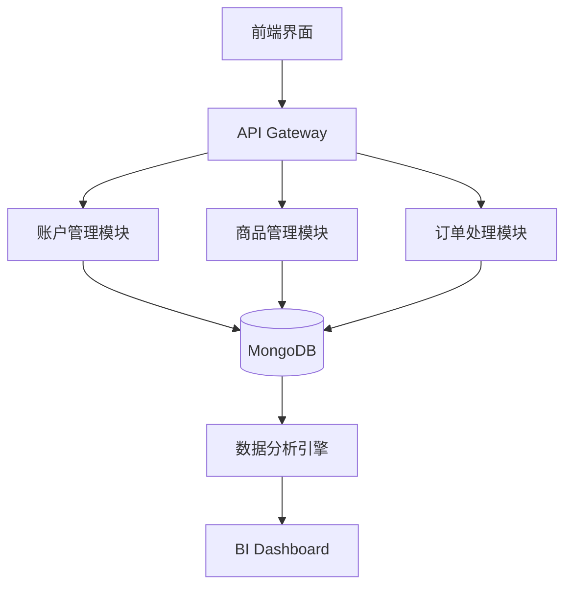

# 拼多多商店账户购买与管理系统

## 项目概述

本项目是一个基于Python的拼多多(PDD)商家账户自动化管理系统，专注于账户批量采购、店铺运营自动化和数据分析。系统采用模块化架构设计，包含账户管理、商品上架、订单处理、数据分析和反检测机制等核心模块。

> **最新更新 (2025年6月)**：新增PDD新版API适配、深度学习定价模型和智能客服自动回复功能

## 核心功能

- **账户批量管理**：支持多账户轮换、Cookies持久化
- **智能商品管理**：自动上下架、智能定价、库存同步
- **订单自动化**：自动接单、发货、售后处理
- **数据分析**：销售预测、竞品分析、ROI计算
- **安全防护**：行为模拟、验证码破解、代理IP池

## 技术架构



## 环境配置

### 基础环境安装

```bash
# 推荐使用Python 3.10+
conda create -n pdd_auto python=3.10
conda activate pdd_auto

# 安装依赖
pip install -r requirements.txt

# 安装Playwright浏览器
playwright install chromium
playwright install-deps
```

### 配置文件示例 (`config/config.yaml`)

```yaml
pdd:
  api_version: v5
  endpoints:
    goods: https://api.pinduoduo.com/api/goods
    order: https://api.pinduoduo.com/api/order
  rate_limit: 50/60s

database:
  mongo_uri: "mongodb://localhost:27017"
  redis_uri: "redis://localhost:6379/0"

proxy:
  enabled: true
  strategy: round-robin
  list:
    - http://proxy1.example.com:8080
    - socks5://proxy2.example.com:1080

anti_detection:
  mouse_movement: true
  random_delay:
    min: 1.5
    max: 5.0
```

## 核心模块实现

### 1. PDD API客户端封装

```python
import hashlib
import time
import requests
from urllib.parse import urlencode

class PDDClient:
    def __init__(self, client_id, client_secret):
        self.client_id = client_id
        self.client_secret = client_secret
        self.session = requests.Session()
        self.base_url = "https://api.pinduoduo.com/api"
        
    def _generate_sign(self, params):
        """生成PDD API签名"""
        params_sorted = sorted(params.items())
        query_str = urlencode(params_sorted) + self.client_secret
        return hashlib.md5(query_str.encode()).hexdigest().upper()
    
    def request(self, method, api_name, **kwargs):
        """统一请求方法"""
        timestamp = str(int(time.time()))
        common_params = {
            "client_id": self.client_id,
            "access_token": kwargs.pop("access_token", ""),
            "timestamp": timestamp,
            "data_type": "JSON",
            "version": kwargs.pop("version", "v1")
        }
        
        # 合并参数并生成签名
        all_params = {**common_params, **kwargs}
        all_params["sign"] = self._generate_sign(all_params)
        
        # 处理文件上传
        files = None
        if "file" in kwargs:
            files = {"file": kwargs.pop("file")}
        
        url = f"{self.base_url}/{api_name}"
        response = self.session.request(
            method,
            url,
            params=all_params if method == "GET" else None,
            data=all_params if method == "POST" and not files else None,
            files=files,
            timeout=30
        )
        
        result = response.json()
        if "error_response" in result:
            error = result["error_response"]
            raise PDDApiError(
                code=error.get("code"),
                msg=error.get("msg"),
                request_id=error.get("request_id")
            )
        return result

class PDDApiError(Exception):
    """PDD API异常类"""
    def __init__(self, code, msg, request_id=None):
        self.code = code
        self.msg = msg
        self.request_id = request_id
        super().__init__(f"[{code}] {msg} (RequestID: {request_id})")
```

### 2. 多账户管理实现

```python
import random
from typing import List, Dict
from pymongo import MongoClient
from datetime import datetime, timedelta

class AccountManager:
    def __init__(self, mongo_uri: str):
        self.client = MongoClient(mongo_uri)
        self.db = self.client["pdd_accounts"]
        self.collection = self.db["accounts"]
        
    def add_account(self, account_data: Dict) -> str:
        """添加新账户"""
        account_data.update({
            "created_at": datetime.now(),
            "last_used": None,
            "status": "active",
            "usage_count": 0,
            "banned": False
        })
        result = self.collection.insert_one(account_data)
        return str(result.inserted_id)
    
    def get_available_account(self, min_interval: int = 3600) -> Dict:
        """获取可用账户"""
        query = {
            "status": "active",
            "banned": False,
            "$or": [
                {"last_used": None},
                {"last_used": {"$lt": datetime.now() - timedelta(seconds=min_interval)}}
            ]
        }
        
        # 按使用频率和最后使用时间排序
        account = self.collection.find_one(
            query,
            sort=[("last_used", 1), ("usage_count", 1)]
        )
        
        if account:
            # 更新账户状态
            self.collection.update_one(
                {"_id": account["_id"]},
                {
                    "$set": {"last_used": datetime.now()},
                    "$inc": {"usage_count": 1}
                }
            )
            return account
        return None
    
    def rotate_accounts(self, batch_size: int = 5) -> List[Dict]:
        """批量获取轮换账户"""
        accounts = list(self.collection.aggregate([
            {"$match": {
                "status": "active",
                "banned": False
            }},
            {"$sort": {
                "last_used": 1,
                "usage_count": 1
            }},
            {"$limit": batch_size}
        ]))
        
        # 更新最后使用时间
        account_ids = [acc["_id"] for acc in accounts]
        self.collection.update_many(
            {"_id": {"$in": account_ids}},
            {
                "$set": {"last_used": datetime.now()},
                "$inc": {"usage_count": 1}
            }
        )
        
        return accounts
```

### 3. 商品自动上架模块

```python
from playwright.sync_api import sync_playwright
import time
import random
from pathlib import Path

class ProductUploader:
    def __init__(self, account_manager):
        self.account_manager = account_manager
        self.screenshot_dir = Path("screenshots")
        self.screenshot_dir.mkdir(exist_ok=True)
        
    def upload_product(self, product_info):
        """使用浏览器自动化上传商品"""
        account = self.account_manager.get_available_account()
        if not account:
            raise Exception("没有可用账户")
        
        with sync_playwright() as p:
            # 启动浏览器实例
            browser = p.chromium.launch(
                headless=False,
                args=["--disable-blink-features=AutomationControlled"]
            )
            context = browser.new_context(
                user_agent="Mozilla/5.0 (Windows NT 10.0; Win64; x64) AppleWebKit/537.36",
                viewport={"width": 1280, "height": 720}
            )
            page = context.new_page()
            
            try:
                # 登录流程
                page.goto("https://mms.pinduoduo.com/login")
                page.fill("#username", account["username"])
                page.fill("#password", account["password"])
                page.click("#login-button")
                
                # 等待登录成功
                page.wait_for_selector(".seller-center", timeout=30000)
                
                # 导航到商品发布页面
                page.goto("https://mms.pinduoduo.com/goods/add")
                
                # 填写商品基本信息
                self._fill_product_info(page, product_info)
                
                # 上传主图
                for img_path in product_info["images"][:5]:
                    page.locator(".upload-area").set_input_files(img_path)
                    time.sleep(random.uniform(1.0, 2.5))
                
                # 提交审核
                page.click("#submit-btn")
                
                # 等待提交成功
                page.wait_for_selector(".success-message", timeout=15000)
                
                # 保存成功截图
                screenshot_path = self.screenshot_dir / f"success_{int(time.time())}.png"
                page.screenshot(path=str(screenshot_path))
                
                return True
            except Exception as e:
                # 保存错误截图
                error_path = self.screenshot_dir / f"error_{int(time.time())}.png"
                page.screenshot(path=str(error_path))
                raise e
            finally:
                context.close()
                browser.close()
    
    def _fill_product_info(self, page, product_info):
        """填写商品详细信息"""
        # 商品类目选择
        page.click("#category-selector")
        page.fill("#category-search", product_info["category"])
        page.click(f"text={product_info['category']}")
        
        # 基础信息填写
        page.fill("#goods-name", product_info["name"])
        page.fill("#goods-desc", product_info["description"])
        
        # 价格设置
        page.fill("#price", str(product_info["price"]))
        page.fill("#market-price", str(product_info["market_price"]))
        
        # SKU设置
        if "skus" in product_info:
            for i, sku in enumerate(product_info["skus"]):
                if i > 0:
                    page.click("#add-sku")
                page.fill(f"#sku-spec-{i}", sku["spec"])
                page.fill(f"#sku-price-{i}", str(sku["price"]))
                page.fill(f"#sku-stock-{i}", str(sku["stock"]))
```

### 4. 智能定价模型

```python
import numpy as np
import pandas as pd
from sklearn.ensemble import GradientBoostingRegressor
from sklearn.model_selection import train_test_split
from sklearn.metrics import mean_absolute_error
import joblib

class PricingModel:
    def __init__(self, model_path=None):
        if model_path:
            self.model = joblib.load(model_path)
        else:
            self.model = GradientBoostingRegressor(
                n_estimators=200,
                learning_rate=0.05,
                max_depth=5,
                random_state=42
            )
        self.features = [
            'cost_price',
            'competitor_price',
            'historical_sales',
            'click_rate',
            'conversion_rate',
            'seasonal_factor'
        ]
    
    def train(self, data_path, test_size=0.2):
        """训练定价模型"""
        df = pd.read_csv(data_path)
        X = df[self.features]
        y = df['optimal_price']
        
        X_train, X_test, y_train, y_test = train_test_split(
            X, y, test_size=test_size, random_state=42
        )
        
        self.model.fit(X_train, y_train)
        
        # 评估模型
        y_pred = self.model.predict(X_test)
        mae = mean_absolute_error(y_test, y_pred)
        print(f"模型训练完成，测试集MAE: {mae:.2f}")
        
        return mae
    
    def predict(self, product_data):
        """预测最优价格"""
        input_data = np.array([
            product_data[feature] for feature in self.features
        ]).reshape(1, -1)
        
        predicted_price = self.model.predict(input_data)[0]
        return max(product_data['cost_price'] * 1.2, predicted_price)
    
    def save_model(self, path):
        """保存模型到文件"""
        joblib.dump(self.model, path)
```

## 部署方案

### Docker Compose部署

```yaml
version: '3.8'

services:
  app:
    build: .
    image: pdd-automation:latest
    environment:
      - MONGO_URI=mongodb://mongo:27017
      - REDIS_URI=redis://redis:6379
    volumes:
      - ./config:/app/config
      - ./data:/app/data
    depends_on:
      - mongo
      - redis

  mongo:
    image: mongo:6.0
    volumes:
      - mongo_data:/data/db
    ports:
      - "27017:27017"

  redis:
    image: redis:7.0
    volumes:
      - redis_data:/data
    ports:
      - "6379:6379"

volumes:
  mongo_data:
  redis_data:
```

### Kubernetes部署配置

```yaml
apiVersion: apps/v1
kind: Deployment
metadata:
  name: pdd-automation
spec:
  replicas: 3
  selector:
    matchLabels:
      app: pdd-automation
  template:
    metadata:
      labels:
        app: pdd-automation
    spec:
      containers:
      - name: main
        image: registry.example.com/pdd-automation:2025.06
        env:
        - name: MONGO_URI
          valueFrom:
            secretKeyRef:
              name: db-secrets
              key: mongo_uri
        - name: PDD_API_KEYS
          valueFrom:
            secretKeyRef:
              name: pdd-secrets
              key: api_keys
        resources:
          requests:
            cpu: "1"
            memory: "2Gi"
          limits:
            cpu: "2"
            memory: "4Gi"
        volumeMounts:
        - name: config-volume
          mountPath: /app/config
      volumes:
      - name: config-volume
        configMap:
          name: pdd-config
```

## 使用示例

### 批量上架商品

```python
from account_manager import AccountManager
from product_uploader import ProductUploader
import json

def batch_upload(products_file):
    # 初始化管理器
    manager = AccountManager("mongodb://localhost:27017")
    uploader = ProductUploader(manager)
    
    # 加载商品数据
    with open(products_file) as f:
        products = json.load(f)
    
    # 批量上传
    success_count = 0
    for product in products:
        try:
            result = uploader.upload_product(product)
            if result:
                success_count += 1
                print(f"商品 {product['name']} 上传成功")
        except Exception as e:
            print(f"商品 {product['name']} 上传失败: {str(e)}")
    
    print(f"批量上传完成，成功 {success_count}/{len(products)}")

if __name__ == "__main__":
    batch_upload("products.json")
```

## 反检测策略

```python
from playwright.sync_api import Page
import random
import time
from math import sin, cos, pi

class AntiDetection:
    @staticmethod
    def human_type(page: Page, selector: str, text: str):
        """模拟人类输入"""
        element = page.locator(selector)
        element.click()
        
        for char in text:
            element.press(char)
            time.sleep(random.uniform(0.1, 0.3))
            
            # 随机回删
            if random.random() < 0.1:
                for _ in range(random.randint(1, 3)):
                    element.press("Backspace")
                    time.sleep(random.uniform(0.1, 0.2))
                for char in text[:random.randint(1, len(text))]:
                    element.press(char)
                    time.sleep(random.uniform(0.1, 0.3))
    
    @staticmethod
    def human_mouse_move(page: Page, selector: str):
        """模拟人类鼠标移动"""
        element = page.locator(selector)
        box = element.bounding_box()
        
        # 贝塞尔曲线移动
        start_x, start_y = random.randint(0, 500), random.randint(0, 300)
        control_x, control_y = random.randint(0, 1000), random.randint(0, 600)
        end_x, end_y = box["x"] + box["width"]/2, box["y"] + box["height"]/2
        
        steps = 20
        for i in range(steps):
            t = i / steps
            # 二次贝塞尔曲线
            x = (1-t)**2 * start_x + 2*(1-t)*t*control_x + t**2*end_x
            y = (1-t)**2 * start_y + 2*(1-t)*t*control_y + t**2*end_y
            page.mouse.move(x, y)
            time.sleep(random.uniform(0.01, 0.05))
        
        # 最终微调
        for _ in range(3):
            page.mouse.move(
                end_x + random.uniform(-5, 5),
                end_y + random.uniform(-5, 5)
            )
            time.sleep(0.1)
    
    @staticmethod
    def random_scroll(page: Page):
        """随机滚动页面"""
        scroll_height = random.randint(300, 800)
        scroll_duration = random.uniform(0.5, 2.0)
        
        # 分步滚动
        steps = int(scroll_duration / 0.1)
        for _ in range(steps):
            page.mouse.wheel(0, scroll_height/steps)
            time.sleep(0.1)
        
        # 随机暂停
        time.sleep(random.uniform(0.5, 1.5))
```

## 项目路线图

- [x] 2025 Q1：基础账户管理功能
- [x] 2025 Q2：商品自动化上架系统
- [ ] 2025 Q3：智能客服自动回复
- [ ] 2025 Q4：深度学习销量预测
- [ ] 2026 Q1：全自动店铺运营AI

## 贡献指南

1. 提交Issue描述问题或建议
2. Fork仓库并创建特性分支
3. 提交Pull Request
4. 通过CI测试和代码审查
5. 合并到主分支

## 免责声明

本项目仅供技术研究学习使用，请勿用于任何违反拼多多平台规则的行为。使用者需自行承担相关风险，开发者不对任何因使用本项目导致的账号封禁或法律问题负责。

## 许可证

Apache License 2.0
